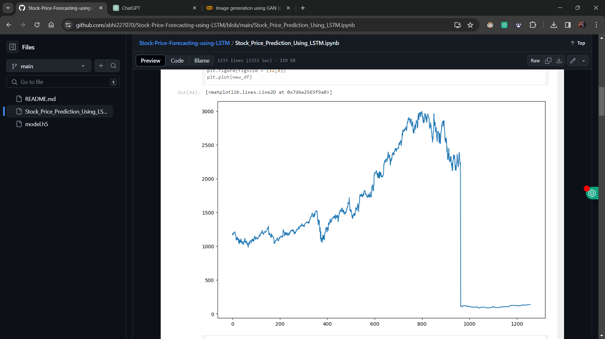
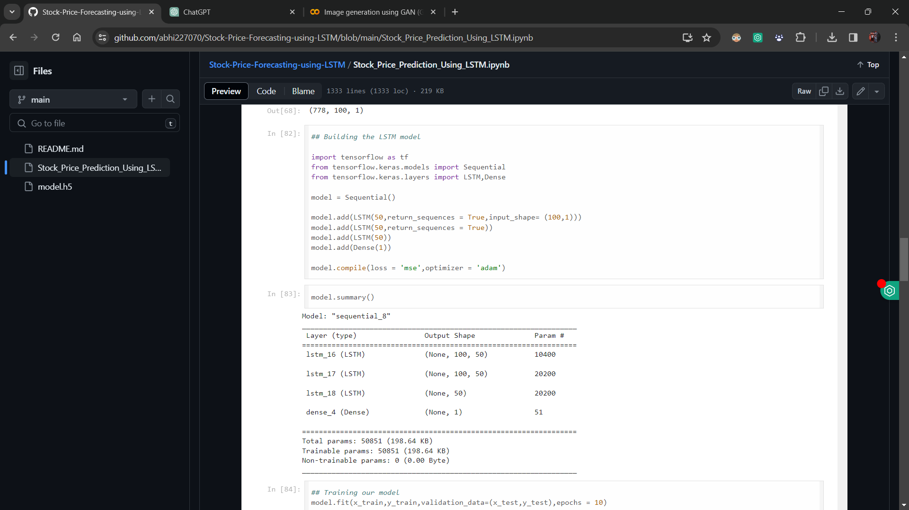
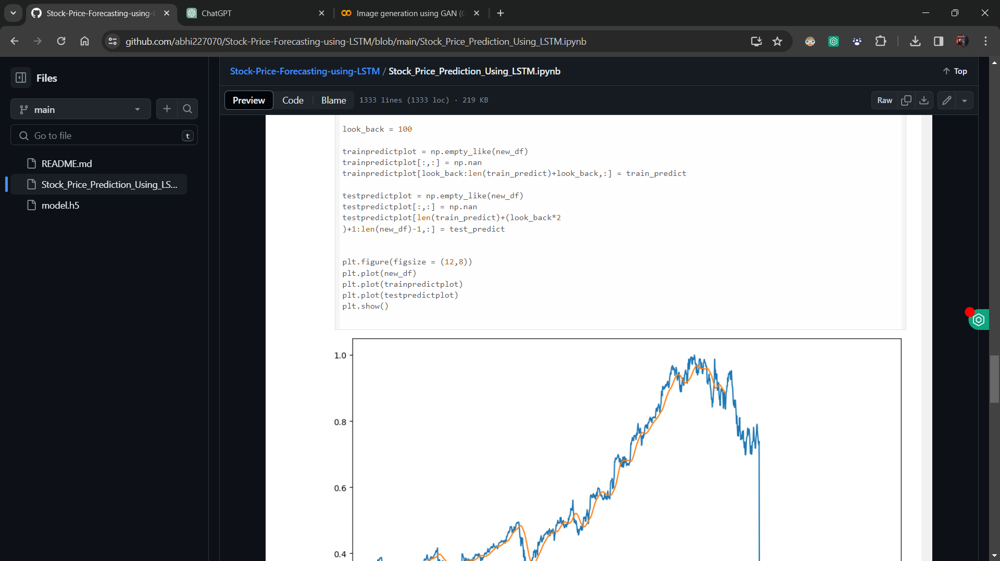

# Stock Price Forecasting using LSTM

This project focuses on predicting stock prices using Long Short-Term Memory (LSTM) neural networks. The LSTM model is trained on the time series data of Google Stock prices. The project involves data collection, preprocessing, model building, training, and prediction steps. The data is fetched from Tiingo using the pandas datareader library, and an API key is required to access the data.

## Table of Contents
- [Key Features](#key-features)
- [Use Case](#use-case)
- [Usage](#usage)
  - [Setup](#setup)
  - [Data Collection](#data-collection)
  - [Data Preprocessing](#data-preprocessing)
  - [Model Building](#model-building)
  - [Training](#training)
  - [Prediction](#prediction)
- [Screenshots](#screenshots)
- [Note](#note)
- [License](#license)

## Key Features
- Utilizes LSTM neural networks for stock price forecasting.
- Fetches data from Tiingo using the pandas datareader library.
- Requires an API key to access Tiingo data.

## Use Case
- Stock Market Forecasting: Predict future stock prices for trading and investment decisions.

## Usage
### Setup
1. Clone the repository to your local machine.
2. Install the necessary dependencies, including Python, TensorFlow, pandas, and pandas datareader.

### Data Collection
1. Obtain an API key from Tiingo to access the stock price data.
2. Replace the placeholder API key in the project with your own Tiingo API key.

### Data Preprocessing
1. Preprocess the fetched stock price data, including handling missing values and scaling.

### Model Building
1. Build the LSTM model architecture for stock price forecasting.

### Training
1. Train the LSTM model on the preprocessed stock price data.
2. Utilize Google Colab with GPU acceleration for faster training.

### Prediction
1. Use the trained LSTM model to make predictions on future stock prices.

## Screenshots

## Note
- No graphical user interface (UI) is provided. Run the project on Google Colab for faster training with GPU acceleration.
- Replace the placeholder Tiingo API key with your own API key to fetch data.

## License
This project is licensed under the MIT License. See the [LICENSE](LICENSE) file for details.

For any inquiries or support, please contact [abhijeetmaharana77@gmail.com](abhijeetmaharana77@gmail.com).
